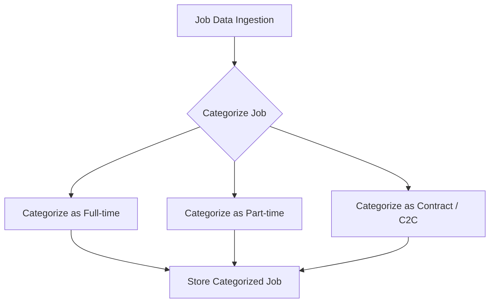
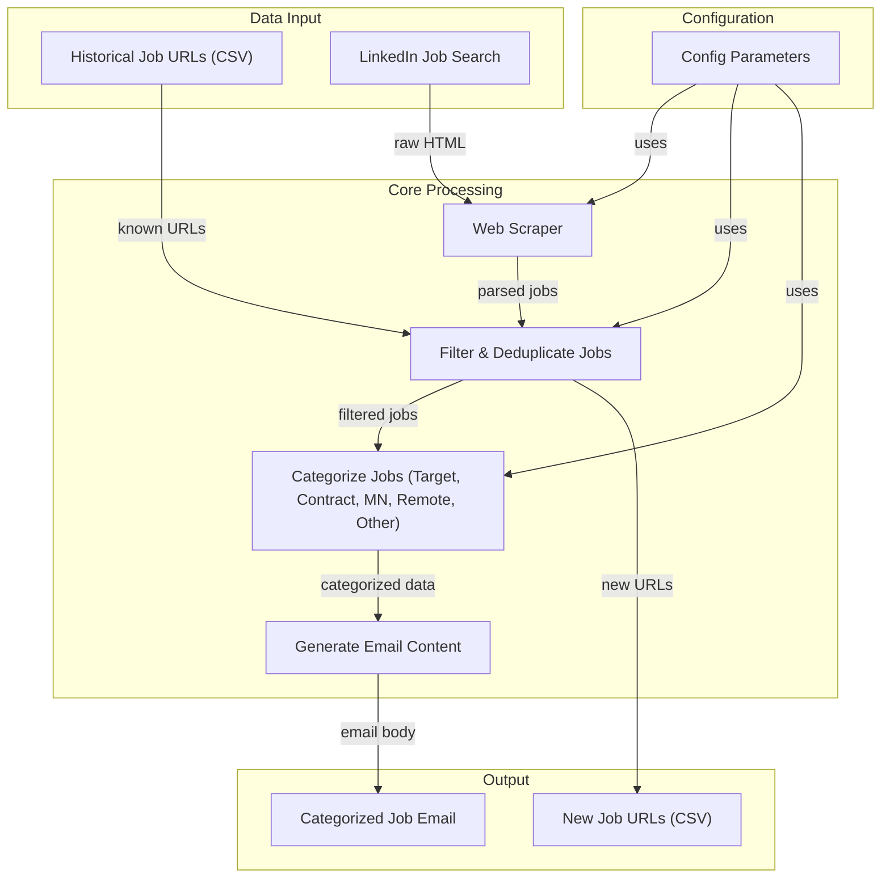

# Omni-Doc Analysis Report

*Automated documentation analysis for this pull request.*


## Summary

**PR:** add section for contract roles
**Author:** @readalong

| Metric                 | Count |
| ---------------------- | ----- |
| Total Findings         | 6     |
| :red_circle: Critical  | 0     |
| :orange_circle: High   | 1     |
| :yellow_circle: Medium | 4     |
| :white_circle: Low     | 1     |
| :blue_circle: Info     | 0     |

**By Type:** **diagram_needed:** 1 | **discrepancy:** 1 | **improvement:** 1 | **missing_doc:** 1 | **outdated:** 2

## Findings

### :orange_circle: Contract role filtering not documented
`README.md` → **Key Features**

The new CONTRACT_KEYWORDS filter and the 'Contract / C2C Roles' email section are not mentioned in the Key Features.

**Recommended Update:**
```markdown
- **Contract Role Filtering**: Identifies contract, C2C, and temporary positions using keyword matching and categorizes them in a dedicated email section.
```

### :yellow_circle: Email content categories are outdated
`README.md` → **Key Features**

The 'Customizable Email Content' feature description is missing the new 'Contract / C2C Roles' category in the list of email sections.

**Recommended Update:**
```markdown
- **Customizable Email Content**: The email report is dynamically generated, categorizing jobs into sections like "Target Companies," "Contract / C2C Roles," "MN Jobs," "Remote Jobs," and "Other Jobs" for quick review.
```

### :yellow_circle: Update System Architecture Diagram for Job Categorization
→ **System Architecture Diagram - Job Categorization**

The 'Categorize Jobs' step in the System Architecture Diagram needs to be updated to explicitly include the handling of 'Contract / C2C Roles'.

**Recommended Update:**


### :yellow_circle: System Architecture Diagram needs update for contract roles
`README.md` → **System Architecture Diagram**

The 'Categorize Jobs' step in the System Architecture Diagram does not reflect the new 'Contract / C2C Roles' category.

**Recommended Update:**
```markdown
F["Categorize Jobs (Target, Contract, MN, Remote, Other)"]
```

### :yellow_circle: Email content description is outdated
`README.md` → **Key Features**

The 'Customizable Email Content' feature description does not list 'Contract / C2C Roles' as a category.

**Recommended Update:**
```markdown
- **Customizable Email Content**: The email report is dynamically generated, categorizing jobs into sections like "Target Companies," "Contract / C2C Roles," "MN Jobs," "Remote Jobs," and "Other Jobs" for quick review.
```

### :white_circle: Update diagram for new job categorization
`README.md` → **System Architecture Diagram**

The 'Categorize Jobs' step in the System Architecture Diagram should be updated to reflect the inclusion of 'Contract / C2C Roles'.

**Recommended Update:**



## Architecture Diagrams

### Update System Architecture Diagram for Job Categorization

The 'Categorize Jobs' step in the System Architecture Diagram needs to be updated to explicitly include the handling of 'Contract / C2C Roles'.


---
*Generated by [Omni-Doc](https://github.com/readalong/omni-doc) - AI-powered documentation analysis*
